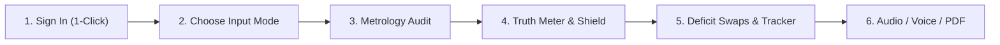

# 🏛️ MitraScan AI — Legal Metrology & Health Intelligence Platform

[](https://github.com)
[](https://consumeraffairs.nic.in/)
[](https://www.fssai.gov.in/)
[](https://nodejs.org)
[-purple?style=for-the-badge)](http://localhost:5000)

> ⚡ **Quick Links**:
> - 🎮 [**Interactive 5-Minute Tour**](#-interactive-5-minute-guided-tour) — Step-by-step click-through guide.
> - 🧪 [**Copy-Paste Test Lab**](#-instant-copy-paste-test-lab) — 3 ready-to-test product samples (no camera needed!).
> - 📖 [**System Walkthrough & Blueprint**](./README_WALKTHROUGH.md) — Deep architectural dive, AI models, engine algorithms, and file walkthrough.

---

## 🌟 What is MitraScan AI?

**MitraScan AI** is an intelligent audit and consumer safety platform for packaged consumer goods. It bridges the gap between **statutory legal compliance** and **consumer bio-safety** in one unified, real-time interface:

1. **🏛️ Legal Metrology Compliance (Rule 6)**: Instantly scans packaged commodities and e-commerce listings against India's **Legal Metrology (Packaged Commodities) Rules, 2011**, detecting 7 mandatory declarations.
2. **🏆 The Truth Meter (Anti-Healthwashing Radar)**: Cross-examines front-of-pack marketing claims (*"Zero Sugar"*, *"Rich in Oats"*, *"100% Natural"*) against back-of-pack ingredient realities to expose consumer deception (0–100% Deception Index).
3. **🛡️ Personalized Health Shield**: Proactively screens for chronic condition hazards: **Diabetic (Type 2)**, **Hypertension (High BP)**, **Child Safety (<5 yrs)**, **Gut Microbiome**, **Celiac/Gluten-Free**, and **Nut Allergies**.
4. **🥗 Healthier Deficit Alternatives (<140 kcal)**: Automatically classifies items into 9 snack categories and suggests crave-matched, low-calorie deficit swaps with **1-click tracking**.
5. **🔊 Sensory & Voice Feedback**: Synthesizes a real-time hazard alarm sound for dangerous additives and speaks verdicts aloud in **Hindi (हिन्दी)** and **English**.

---

## ⚡ Quick Start in 60 Seconds

You do **NOT** need to configure databases or API keys to test MitraScan AI. It features an **automatic in-memory database fallback** that works right out of the box!

### Option 1: 1-Click Launch (Windows)

Simply double-click the included batch launcher:

```powershell
.\start.bat
```

*This automatically launches both the Node.js backend (`http://localhost:5000`) and Vite frontend (`http://localhost:5173`) in one unified console.*

---

### Option 2: Standard Command Line (Any OS)

From the project root directory:

```bash
# Run both backend and frontend concurrently
npm run dev
```

Alternatively, run them in two separate terminal windows:

| Terminal 1: Backend | Terminal 2: Frontend |
| :--- | :--- |
| ```bash<br>cd Backend<br>npm install<br>npm run dev<br>``` | ```bash<br>cd frontend<br>npm install<br>npm run dev<br>``` |
| 🟢 Running on **`http://localhost:5000`** | 🔵 Running on **`http://localhost:5173`** |

---

## 🔑 Instant 1-Click Demo Login

Open your browser to: **`http://localhost:5173`**

You will see the MitraScan login screen. You can either:
- **Click the button**: `⚡ 1-Click Demo Inspector Sign-In` *(zero typing required!)*
- Or manually use the pre-seeded demo credentials:
  - **Email**: `inspector@mitrascan.com` (or `inspector@example.com`)
  - **Password**: `Password123!`

---

## 🎮 Interactive 5-Minute Guided Tour

Follow these quick steps to experience all capabilities of MitraScan AI:



### Step 1: Sign In
Click **`⚡ 1-Click Demo Inspector Sign-In`** on the login screen to enter the inspector dashboard.

### Step 2: Choose Your Input Mode
On the Audit form, MitraScan supports **4 interactive inspection modes**:
- 📸 **Live Camera Scanner**: Real-time camera feed with targeting reticle, flashlight toggle, and a **3-second hands-free auto-scan countdown**.
- 🖼️ **Label Image Upload**: Drag & drop any JPG, PNG, WEBP, or TIFF product packaging photo.
- 📝 **Paste OCR Text**: Paste packaging text directly for instantaneous analysis *(see test samples below!)*.
- 🌐 **E-Commerce URL Audit**: Enter any public marketplace product URL to audit digital listings against Rule 6.

### Step 3: Inspect Legal Metrology (Rule 6)
View the **Compliance Score Ring** (0–100) and the 7 statutory checks:
- ✅ *Manufacturer & Packer details*
- ✅ *Common / Generic Product Name*
- ✅ *Standard Net Quantity (SI units)*
- ✅ *Date of Manufacture / Packaging*
- ✅ *MRP with 'inclusive of all taxes'*
- ✅ *Consumer Care helpline and email*
- ✅ *Country of Origin*

### Step 4: Check The Truth Meter & Bio-Safety Shield
- **The Truth Meter**: Evaluates marketing slogans vs actual ingredients (e.g. catches Maltodextrin in *"Zero Sugar"* cookies).
- **Health Shield**: Toggle conditions like **Diabetic**, **Hypertension**, or **Child Safe** to see immediate red/yellow bio-safety warnings.

### Step 5: Try Category-Matched Deficit Swaps
If the scanned item is junk food, MitraScan classifies it into one of 9 categories and provides **3–4 healthier deficit swaps (<140 kcal)**.
- Click **`＋ Log Swap`** on any card — it automatically increments your **Smart Calorie Tracker** budget in real-time!

### Step 6: Sensory Feedback & PDF Export
- 🔊 **Hazard Alarm**: When dangerous additives (palm oil, synthetic dyes) are detected, a synthesized dual-tone audio beep sounds.
- 🗣️ **Voice Assistant**: Click the voice bar at the bottom to hear the verdict read aloud in **English** or **Hindi**.
- 📄 **Download PDF Report**: Click **Download PDF Report** to generate a publication-ready compliance certificate with a legal seal.

---

## 🧪 Instant Copy-Paste Test Lab

Want to test the system immediately without a camera or physical snack?
Click the **"Paste OCR Text"** tab on the audit screen and copy-paste any of these 3 curated test cases:

### Sample 1: 100% Compliant Healthy Biscuit (Perfect Score)

> **Expected Outcome**: Compliance Score **100/100 (Compliant)** • Truth Meter **100% Honest** • No hazard flags.

```text
Mfd. by: Britannia Industries Ltd., 5/1A Hungerford Street, Kolkata 700017
Product: 100% Whole Wheat Digestive Biscuits
Net Quantity: 200 g
Mfg Date: 08/2026
MRP: Rs. 45.00 (inclusive of all taxes)
Customer Care: 1800-425-4449 or feedback@britannia.co.in
Country of Origin: India
Ingredients: Whole Wheat Flour (Atta) 65%, Rolled Oats 15%, Jaggery, Edible Vegetable Oil (Sunflower Oil), Salt.
Nutrition per 100g: Energy 410 kcal, Protein 9.5g, Carbohydrate 68g, Sugar 6.0g, Fat 11g, Sodium 180mg.
```

---

### Sample 2: Deceptive "Zero Sugar" Healthwashing Cookie

> **Expected Outcome**: Compliance Score **100/100** • Truth Meter **Deception Warning (40–60%)** • Flags hidden high-glycemic Maltodextrin & Sucralose.

```text
Manufactured by: Wellness Foods Pvt Ltd, Industrial Area, Gurugram 122001
Product: Zero Sugar High Protein Oats Cookie
Net Qty: 150 g
PKD: 07/2026
Maximum Retail Price: Rs 90.00 incl. of all taxes
Consumer Helpline: 1800-111-2233 email: support@wellnessfoods.in
Made in India
Ingredients: Refined Wheat Flour (Maida) 55%, Palm Oil, Oats 4%, Maltodextrin, Invert Sugar Syrup, Artificial Sweetener (Sucralose INS 955), Preservative (INS 211).
Nutrition per 100g: Energy 490 kcal, Protein 4.2g, Carbohydrates 65g, Sugar 0.8g, Fat 22g, Sodium 420mg.
```

---

### Sample 3: Ultra-Processed Fried Namkeen (Hazard Alarm Trigger)

> **Expected Outcome**: Triggers **Dual-Tone Audio Hazard Alarm** 🔊 • Flags **Palm Oil**, **TBHQ (INS 319)**, **Excess Sodium** • Proposes **Roasted Makhana / Chana Deficit Swaps (<140 kcal)** • Fails **Child Safety Shield**.

```text
Packed by: Desi Crunch Foods Ltd, Phase 2, Okhla, New Delhi 110020
Commodity: Crispy Spicy Fried Bhujia Namkeen
Net Weight: 400 g
Date of Mfg: 09/2026
M.R.P.: ₹ 120.00 (inclusive of all taxes)
Consumer Care Cell: Phone 011-26810000 care@desicrunch.com
Country of Origin: India
Ingredients: Tepary Bean Flour, Gram Flour, Palm Kernel Oil, Excessive Salt (Sodium 1250mg), Spices, Preservative TBHQ (INS 319), Synthetic Food Colour Tartrazine (INS 102).
Nutrition per 100g: Energy 580 kcal, Protein 6.0g, Carbohydrate 42g, Fat 44g, Saturated Fat 21g, Sodium 1250mg.
```

---

## 🏛️ Legal Metrology Rule 6 Checklist

MitraScan AI's compliance engine enforces all 7 statutory declarations mandated under **Rule 6 of the Legal Metrology (Packaged Commodities) Rules, 2011**:

| # | Mandatory Declaration | Requirement Under Rule 6 | Engine Detection Patterns |
| :-: | :--- | :--- | :--- |
| **1** | **Manufacturer / Packer** | Complete legal name and physical address | `Mfg. by`, `Mfd. by`, `Packed by`, `Pvt Ltd`, `FSSAI Lic No.` |
| **2** | **Product Name** | Common or generic commodity name | Recognizes standard snack and grocery commodity classes |
| **3** | **Net Quantity** | Standard metric weight, volume, or count | `g`, `kg`, `ml`, `l`, `N`, `U` with prefix `Net Wt` / `Net Qty` |
| **4** | **Date of Packing** | Month and year of packaging or import | `MM/YY`, `MM/YYYY`, `Best Before`, `Date of Mfg` |
| **5** | **MRP with Taxes** | Maximum retail price inclusive of all taxes | `₹`, `Rs.`, `MRP` with `incl. of all taxes` / `inclusive of taxes` |
| **6** | **Consumer Care** | Mandatory grievance contact (helpline + email) | `1800/1860` toll-free, STD landlines, email address, care cell |
| **7** | **Country of Origin** | Country of origin or assembly | `Country of Origin: [Country]`, `Made in India`, `Product of India` |

---

## 🏗️ System Architecture

MitraScan AI is built on a modular 6-tier architecture:

```text
┌─────────────────────────────────────────────────────────────────────────────┐
│ 1. CLIENT LAYER: React 19 + Vite                                            │
│    • Live Camera (3s Auto-Scan)  • Drag & Drop Image  • OCR Paste  • URL    │
└──────────────────────────────────────┬──────────────────────────────────────┘
                                       │ Bearer JWT / Multipart
┌──────────────────────────────────────▼──────────────────────────────────────┐
│ 2. APPLICATION SERVER: Node.js + Express 5                                   │
│    • Auth Middleware (RBAC)      • Multer File Storage  • Rate Controls     │
└──────────────────────────────────────┬──────────────────────────────────────┘
                                       │
┌──────────────────────────────────────▼──────────────────────────────────────┐
│ 3. COMPUTER VISION & OCR PIPELINE                                            │
│    • Sharp: EXIF auto-rotation, alpha flattening, grayscale conversion       │
│    • Tesseract.js: LSTM Deep Recurrent Neural Network character reader       │
└──────────────────────────────────────┬──────────────────────────────────────┘
                                       │ Extracted Packaging Text Tokens
┌──────────────────────────────────────▼──────────────────────────────────────┐
│ 4. THE 4 ANALYTICAL AI ENGINES                                               │
│    ├─► complianceEngine.js   : Legal Metrology Rule 6 (multi-line stitching) │
│    ├─► healthEngine.js       : Nutrient parsing & 9-category deficit swaps   │
│    ├─► healthwashingEngine.js: Front-vs-Back claim deception (The Truth Meter)│
│    └─► healthShieldEngine.js : Bio-safety risks (Diabetic, BP, Child, Gut)   │
└──────────────────────────────────────┬──────────────────────────────────────┘
                                       │
┌──────────────────────────────────────▼──────────────────────────────────────┐
│ 5. STORAGE & REPORT EXPORT                                                   │
│    • MongoDB Atlas (Primary) / In-Memory Store (Zero-Config Fallback)        │
│    • Puppeteer: Headless Chromium PDF Certificate Generator                  │
└──────────────────────────────────────┬──────────────────────────────────────┘
                                       │
┌──────────────────────────────────────▼──────────────────────────────────────┐
│ 6. SENSORY FEEDBACK & USER CONTROLS                                         │
│    • Web Audio API Dual-Tone Alarm  • Web Speech Multilingual Voice (HI/EN) │
│    • Smart Calorie Tracker (1-Click Swap Log)  • TruthMeter Radial Gauge    │
└─────────────────────────────────────────────────────────────────────────────┘
```

---

## 📁 Repository Structure

```text
MitraScan-AI/
├── start.bat                 # ⚡ 1-Click launcher for Windows (Starts both servers)
├── run-dev.js                # Cross-platform Node.js concurrent launcher
├── README.md                 # Primary documentation & interactive quickstart
├── README_WALKTHROUGH.md     # Complete architectural & technical masterclass
│
├── Backend/                  # Express REST API Server
│   ├── config/               # Database connection & environment configuration
│   ├── controllers/          # Audit, authentication, and health controllers
│   ├── middleware/           # JWT auth, upload validation, and error handling
│   ├── models/               # MongoDB Mongoose schemas (Audit, User)
│   ├── repositories/         # Storage layer (MongoDB + in-memory store)
│   ├── routes/               # REST route declarations
│   ├── services/             # The 4 Analytical Engines, OCR, and PDF services
│   ├── server.js             # Server startup entrypoint (Port 5000)
│   └── package.json
│
└── frontend/                 # React 19 + Vite User Interface
    ├── src/
    │   ├── components/       # LiveCameraScanner, TruthMeter, CalorieTracker, etc.
    │   ├── services/         # REST API clients, Web Audio beeper, Web Speech voice
    │   ├── App.jsx           # Main shell & audit orchestrator
    │   ├── App.css           # Responsive styling & themes
    │   └── main.jsx          # React DOM root
    ├── vite.config.js        # Vite dev server with /api proxy (Port 5173)
    └── package.json
```

---

## 🔌 API Quick Reference

All endpoints are hosted at `http://localhost:5000`. When using the Vite dev server, calls to `/api/*` are automatically proxied.

| Method | Endpoint | Description | Auth Required |
| :--- | :--- | :--- | :---: |
| `GET` | `/api/health` | Server health check & storage status | ❌ No |
| `POST` | `/api/auth/login` | Inspector login (Returns JWT token) | ❌ No |
| `POST` | `/api/auth/register` | Create new inspector account | ❌ No |
| `GET` | `/api/auth/me` | Current authenticated inspector profile | ✅ Yes (Bearer) |
| `POST` | `/api/audits` | Submit image upload or pasted OCR text | ✅ Yes (Bearer) |
| `POST` | `/api/audits/url` | Submit public e-commerce listing URL | ✅ Yes (Bearer) |
| `GET` | `/api/audits` | Fetch past inspection audit logs | ✅ Yes (Bearer) |
| `GET` | `/api/audits/:id/report` | Download official PDF evidence report | ✅ Yes (Bearer) |

### Quick Health Check Command

```powershell
# In PowerShell:
Invoke-RestMethod http://localhost:5000/api/health
```

Expected response:
```json
{
  "ok": true,
  "storage": "memory",
  "pdfBrowser": "configured"
}
```

---

## 📖 Deep Dive Documentation

For an exhaustive, production-grade technical breakdown, see:
👉 [**README_WALKTHROUGH.md**](./README_WALKTHROUGH.md)

**What is inside the Walkthrough:**
- Full mathematical scoring formulas for Compliance and Health scores.
- Regex heuristics and multi-line context stitching logic.
- Complete 9-category nutrition deficit swaps matrix.
- Web Audio API oscillator synthesis frequency breakdown.
- File-by-file source code walkthrough.
- Interactive cURL testing playground.
- Troubleshooting matrix for cameras, audio autoplay, and Chromium PDF generation.

---

## ⚖️ Legal Disclaimer

*MitraScan AI is an automated screening and consumer safety prototype. It is designed to assist enforcement officers and empower consumers. Automated results do not constitute final legal determinations and must be verified by an authorized inspector prior to statutory enforcement actions.*
