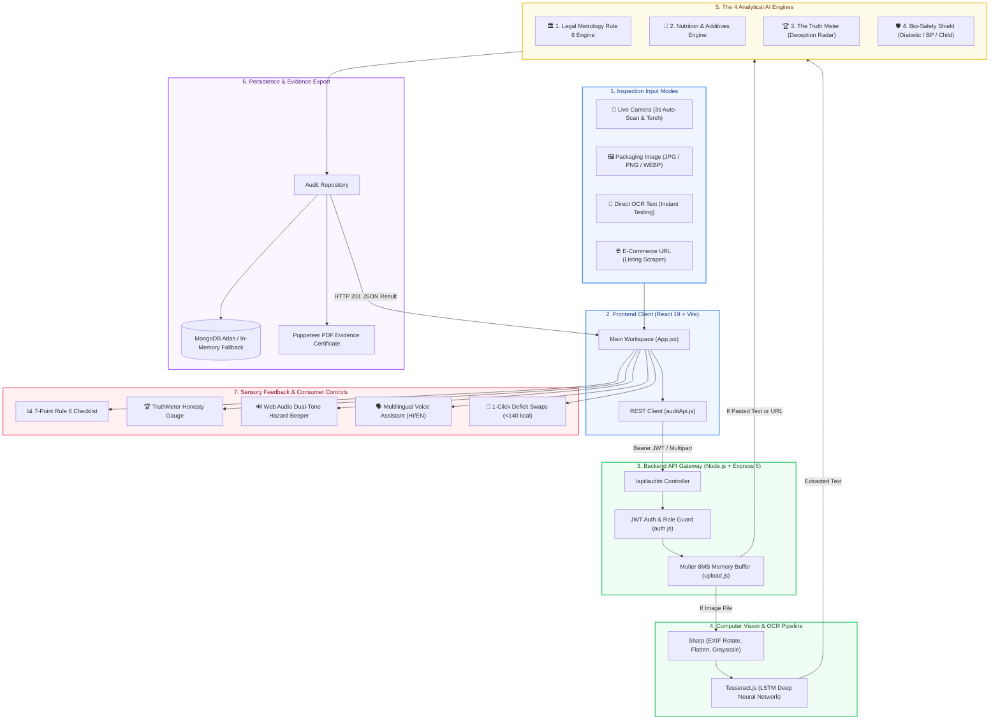

# 🏛️ MitraScan AI — Complete System Walkthrough & Architectural Blueprint

> **Welcome to the MitraScan AI Masterclass Documentation.**  
> This guide provides an exhaustive, highly structured, and interactive breakdown of every layer, algorithm, computer vision pipeline, analytical engine, file, and data flow in **MitraScan AI**.

---

## 📑 Interactive Table of Contents

1. [Executive Overview & Problem Statement](#1-executive-overview--problem-statement)
2. [Interactive System Architecture Diagram](#2-interactive-system-architecture-diagram)
3. [Guided Interactive Tour (Step-by-Step UI Experience)](#3-guided-interactive-tour-step-by-step-ui-experience)
   - [📸 Live Camera Scanner (Hands-Free 3s Auto-Scan)](#-live-camera-scanner-hands-free-3s-auto-scan)
   - [📝 Multi-Modal Auditing (Image, Text, URL)](#-multi-modal-auditing-image-text-url)
   - [🏆 The Truth Meter (Anti-Healthwashing Deception Radar)](#-the-truth-meter-anti-healthwashing-deception-radar)
   - [🛡️ Personalized Health Shield (Bio-Safety Protection)](#-personalized-health-shield-bio-safety-protection)
   - [🥗 Category-Matched Deficit Swaps & 1-Click Calorie Tracker](#-category-matched-deficit-swaps--1-click-calorie-tracker)
   - [🔊 Dual-Tone Hazard Beeper & Regional Voice Assistant](#-dual-tone-hazard-beeper--regional-voice-assistant)
   - [📄 Official PDF Evidence Certificate](#-official-pdf-evidence-certificate)
4. [Computer Vision & OCR Pipeline Deep Dive](#4-computer-vision--ocr-pipeline-deep-dive)
5. [The 4 Core Analytical AI Engines](#5-the-4-core-analytical-ai-engines)
   - [Engine 1: Legal Metrology Rule 6 Compliance Engine](#engine-1-legal-metrology-rule-6-compliance-engine)
   - [Engine 2: Nutrition & Harmful Ingredient Engine](#engine-2-nutrition--harmful-ingredient-engine)
   - [Engine 3: Healthwashing & Deception Engine (The Truth Meter)](#engine-3-healthwashing--deception-engine-the-truth-meter)
   - [Engine 4: Bio-Safety Shield Engine](#engine-4-bio-safety-shield-engine)
6. [Category-Matched Deficit Swaps Matrix (9 Categories)](#6-category-matched-deficit-swaps-matrix-9-categories)
7. [Complete Project Directory & File-by-File Guide](#7-complete-project-directory--file-by-file-guide)
8. [End-to-End Data Lifecycle Walkthrough](#8-end-to-end-data-lifecycle-walkthrough)
9. [Interactive API Playground & cURL Testing Guide](#9-interactive-api-playground--curl-testing-guide)
10. [Configuration, Database Modes & Troubleshooting Matrix](#10-configuration-database-modes--troubleshooting-matrix)

---

## 1. Executive Overview & Problem Statement

Modern retail packaged goods suffer from two widespread consumer crises:

| Crisis | What Happens Today | How MitraScan AI Solves It |
| :--- | :--- | :--- |
| **Statutory Non-Compliance** | Manufacturers omit mandatory declarations (MRP breakdown, customer care, date of packing, origin) or print them in obscure locations. | **Automated Legal Metrology Audit**: Scans physical packaging or e-commerce URLs against India's **Legal Metrology (Packaged Commodities) Rules, 2011 (Rule 6)** in seconds. |
| **Healthwashing Deception** | Products feature glossy front-of-pack slogans (*"Zero Sugar"*, *"Rich in Oats"*, *"100% Atta"*) while hiding Maltodextrin, Maida, Palm Oil, and chemical preservatives on the back. | **The Truth Meter**: Evaluates front slogans against back ingredient lists, calculating a **0–100% Deception Index** and issuing immediate consumer alerts. |
| **Bio-Safety Blindspots** | Consumers with Diabetes, Hypertension, Celiac disease, or young children cannot easily decipher complex chemical additive codes (INS numbers). | **Personalized Health Shield**: Automatically flags harmful additives, excess sodium, high glycemic syrups, and synthetic dyes tailored to user conditions. |
| **Dietary Friction** | Consumers wanting to cut calories are given vague advice without practical, craving-matched alternatives. | **Category-Matched Deficit Swaps (<140 kcal)**: Identifies the junk food category (e.g. Namkeen or Cookies) and provides direct low-calorie swaps with **1-click tracking**. |

---

## 2. Interactive System Architecture Diagram



---

## 3. Guided Interactive Tour (Step-by-Step UI Experience)

### 📸 Live Camera Scanner (Hands-Free 3s Auto-Scan)
- **Targeting Reticle**: The camera UI provides a framing box to align the product label.
- **Hands-Free 3-Second Auto-Scan**: Once opened, an automated visual countdown timer (`startAutoScanCountdown`) counts down from 3 and snaps the photo automatically — perfect for single-handed mobile inspections.
- **Flashlight / Torch Toggle**: Uses WebRTC media track constraints (`advanced: [{ torch: true }]`) to illuminate labels in dim retail aisles.
- **Hardware-Accelerated Barcode Detection**: Monitors video frames via native `BarcodeDetector` API for standard EAN-13 / UPC codes without server latency.

### 📝 Multi-Modal Auditing (Image, Text, URL)
- **Image Upload**: Accepts labels up to 8 MB. Automatically preprocessed and fed to Tesseract.
- **Paste OCR Text**: Allows manual pasting of label text. Bypasses OCR for **instant zero-latency testing**.
- **E-Commerce URL**: Fetches live public product pages (e.g. Amazon, Blinkit, Zepto, Flipkart), strips scripts/styles, extracts declarations, and audits compliance.

### 🏆 The Truth Meter (Anti-Healthwashing Deception Radar)
- Cross-examines front marketing slogans against back ingredient lists.
- Displays an animated SVG radial gauge ($0\%$ to $100\%$ Honesty Score).
- Reveals the **"Marketing Claim"** vs **"Ingredient Reality"** breakdown (e.g. exposing Maltodextrin in *"Zero Sugar"* cookies).

### 🛡️ Personalized Health Shield (Bio-Safety Protection)
- Allows the user to toggle personal medical vulnerabilities:
  - 🩸 **Diabetic (Type 2)**: Detects high-glycemic syrups, lack of dietary fiber, and hidden sugars.
  - 🫀 **Hypertension (High BP)**: Detects sodium $>300\text{mg}$, trans fats, and palm fats.
  - 👶 **Child Safety (<5 yrs)**: Flags synthetic azo dyes (Tartrazine, Sunset Yellow), excessive caffeine, and chemical preservatives.
  - 🧬 **Gut Microbiome**: Flags synthetic emulsifiers (Polysorbate 80, Carrageenan INS 407).
  - 🌾 **Gluten-Free / Celiac**: Scans for hidden wheat, barley, rye, and malt.
  - 🥜 **Nut Allergy**: Flags peanuts, tree nuts, and shared facility warnings.

### 🥗 Category-Matched Deficit Swaps & 1-Click Calorie Tracker
- Classifies snacks into 9 categories (Biscuits, Chips, Noodles, Chocolates, Soda, etc.).
- Displays **3–4 crave-matched alternatives under 140 kcal**.
- **1-Click Tracking**: Clicking **`＋ Log Swap`** immediately logs the item, updates calories, and saves to browser `localStorage`.

### 🔊 Dual-Tone Hazard Beeper & Regional Voice Assistant
- **Synthesized Hazard Alarm**: Uses Web Audio API to produce an attention-grabbing alternating dual-tone beep ($880\text{ Hz}$ and $659.25\text{ Hz}$) when hazardous ingredients are detected. No audio files needed!
- **Regional Voice Assistant**: Spoken summary read aloud in **English** or **Hindi (हिन्दी)** via Web Speech API.

### 📄 Official PDF Evidence Certificate
- Click **"Download PDF Report"** to receive a tamper-proof official PDF evidence report generated via headless Chromium.
- Includes official Legal Metrology seal, compliance score, violation breakdown, detected evidence text snippets, Truth Meter index, and bio-safety warnings.

---

## 4. Computer Vision & OCR Pipeline Deep Dive

Packaging photography in retail environments frequently suffers from skew, glare, reflections, and mobile camera compression. MitraScan AI solves this through a multi-stage vision pipeline:

```text
Raw Image Buffer (Multer)
         │
         ▼
[Sharp Vision Preprocessor]
  1. .rotate()                  -> Auto-orient based on mobile gyroscope EXIF metadata
  2. .flatten({ bg: '#fff' })   -> Merge transparent PNG channels onto white background
  3. .grayscale()               -> Convert RGB to single-channel luminance
  4. .png()                     -> Lossless conversion preventing JPEG block degradation
         │
         ▼
[Tesseract.js LSTM Neural Network]
  • Deep Long Short-Term Memory (LSTM) recurrent network
  • Trained typography dataset: eng.traineddata (5.2 MB pre-loaded)
  • Adaptive character segmentation and baseline fitting
         │
         ▼
Contiguous Text Tokens for Analytical Engines
```

---

## 5. The 4 Core Analytical AI Engines

### Engine 1: Legal Metrology Rule 6 Compliance Engine
*File: `Backend/services/complianceEngine.js`*

Validates packages against the 7 statutory declarations mandated by **Legal Metrology (Packaged Commodities) Rules, 2011 (Rule 6)**:

| Declaration Key | Statutory Requirement | Regex Heuristic Patterns |
| :--- | :--- | :--- |
| `manufacturer` | Legal name & physical address of manufacturer/packer/importer | `Manufactured by:`, `Mfg. by:`, `Mfd. by:`, `Packed by:`, `Pkd. by:`, `Marketed by:`, `Pvt Ltd`, `Limited`, `FSSAI Lic. No.` |
| `productName` | Common or generic commodity name | Matches standard commodity categories (biscuits, namkeen, noodles, beverages, chips, etc.) |
| `netQuantity` | Permitted standard legal metric SI units | Permitted SI units (`g`, `kg`, `ml`, `l`, `N`, `U`), `Net Wt`, `Net Qty` |
| `date` | Month & year of manufacture/packing | 2-digit & 4-digit years (`MM/YY`, `MM/YYYY`), `MFD:`, `PKD:`, `Date of Mfg:`, `Best before X months` |
| `mrp` | Maximum Retail Price stating inclusive of all taxes | `MRP`, `M.R.P.`, `₹`, `Rs.`, `INR` plus tax qualifiers (`incl. of all taxes`, `inclusive of all taxes`) |
| `consumerCare` | Consumer grievance helpline & email | `1800/1860` toll-free numbers, STD landlines, 10-digit mobile numbers, `feedback@...`, `care cell` |
| `origin` | Country of origin | `Country of Origin: [Country]`, `Made in India`, `Product of India`, `Manufactured in India` |

#### Smart Multi-Line Context Stitching
Camera OCR frequently breaks continuous legal text across multiple lines (e.g. `MRP:` on line 1 and `Rs. 45 (INCL. OF ALL TAXES)` on line 2). MitraScan AI inspects preceding and succeeding line windows to stitch fractured evidence into a single contiguous verification string.

#### Compliance Scoring Formula:
$$\text{Compliance Score} = \text{round}\left( \frac{\sum \text{Passed Declarations}}{\text{Total Configured Checks (7)}} \times 100 \right)$$

---

### Engine 2: Nutrition & Harmful Ingredient Engine
*File: `Backend/services/healthEngine.js`*

Extracts nutritional values and flags hazardous chemical additives:

| Additive / Hazard | Pattern Detected | Risk Category | Clinical Impact |
| :--- | :--- | :---: | :--- |
| **Palm Oil / Trans Fats** | `palm oil`, `palmolein`, `hydrogenated fat`, `vanaspati` | 🔴 Danger | Elevates LDL cholesterol, promotes arterial plaque & cardiovascular stiffness |
| **High Fructose Corn Syrup** | `hfcs`, `invert sugar syrup`, `liquid glucose`, `maltodextrin` | 🔴 Danger | Promotes visceral adiposity, fatty liver, and rapid insulin resistance |
| **Synthetic Food Dyes** | `tartrazine (INS 102)`, `sunset yellow (INS 110)`, `allura red (INS 129)` | 🔴 Danger | Petroleum-derived azo dyes linked to child hyperactivity and cellular stress |
| **Chemical Preservatives** | `sodium benzoate (INS 211)`, `bha (INS 320)`, `bht (INS 321)`, `tbhq (INS 319)` | 🔴 Danger | Class-II chemical preservatives with cytotoxic and allergic airway risks |
| **Synthetic Sweeteners** | `aspartame (INS 951)`, `acesulfame-k (INS 950)`, `sucralose (INS 955)` | 🟡 Warning | Disrupts gut microbiome diversity and triggers rebound sweetness cravings |
| **Flavor Enhancers** | `msg (INS 621)`, `disodium inosinate (INS 631)`, `disodium guanylate (INS 635)` | 🟡 Warning | Excitotoxin that overstimulates palate receptors, driving mindless overeating |
| **Excess Sodium** | `Sodium > 600mg` or `Salt > 2g` per 100g | 🟡 Warning | Increases vascular resistance and systemic blood pressure |

#### Health Index Formula:
$$\text{Health Score} = \max\left(0, 100 - (\text{Danger Additives} \times 25) - (\text{Warning Additives} \times 12) - \text{Excess Sugar Penalty} - \text{Excess Sodium Penalty}\right)$$

---

### Engine 3: Healthwashing & Deception Engine (The Truth Meter)
*File: `Backend/services/healthwashingEngine.js`*

Identifies deceptive front-of-pack marketing claims contradicted by back-of-pack ingredients:

```text
Front Claim: "Zero Added Sugar"
Back Reality: Ingredients show Maltodextrin + Invert Syrup (Glycemic Index > 105)
==> DECEPTION DETECTED: Severity High, Deducts 35 points from Truth Index.

Front Claim: "Rich in Oats / 100% Atta"
Back Reality: Ingredients list "Refined Wheat Flour (Maida) 60%, Oats 4%"
==> DECEPTION DETECTED: Severity High, Deducts 30 points from Truth Index.

Front Claim: "100% Natural / Zero Preservatives"
Back Reality: Ingredients list INS 211 (Sodium Benzoate) + INS 102 (Tartrazine)
==> DECEPTION DETECTED: Severity Critical, Deducts 40 points from Truth Index.
```

$$\text{Truth Meter Score} = \max\left(10, 100 - \sum \text{Deceptive Claim Penalties}\right)$$

---

### Engine 4: Bio-Safety Shield Engine
*File: `Backend/services/healthShieldEngine.js`*

Screens for 6 high-risk medical and physiological profiles:
1. 🩸 **Diabetic Shield**: Flags simple sugars, maltodextrin, high glycemic index, and low fiber content.
2. 🫀 **Cardiovascular / Hypertension Shield**: Flags sodium $> 300\text{mg}$ per serving, trans fats, and palm fats.
3. 👶 **Child Safety Shield (<5 yrs)**: Flags synthetic dyes (Tartrazine, Sunset Yellow), high caffeine, and sugar $> 20\%$.
4. 🧬 **Gut Microbiome Shield**: Flags synthetic emulsifiers (Polysorbate 80, Carrageenan INS 407, Carboxymethylcellulose).
5. 🌾 **Celiac / Gluten-Free Shield**: Flags wheat, barley, rye, spelt, and malted grains.
6. 🥜 **Nut Allergy Shield**: Flags peanuts, tree nuts, cashews, almonds, and cross-contamination warnings.

---

## 6. Category-Matched Deficit Swaps Matrix (9 Categories)

When an unhealthy snack is detected, MitraScan AI automatically classifies it into one of 9 categories and provides **craving-matched, nutrient-dense alternatives under 140 kcal**:

| # | Snack Category | Typical Unhealthy Snack | Healthier Deficit Alternative | Calories | Serving Unit | Nutritional Advantage |
| :-: | :--- | :--- | :--- | :---: | :---: | :--- |
| **1** | **Biscuits & Cookies** | Cream cookies, Bourbons | **Roasted Makhana (Foxnuts)** | **95 kcal** | 30g bowl | 60% fewer calories, zero trans fats, rich in magnesium. |
| **1** | **Biscuits & Cookies** | Digestives, Maida biscuits | **Baked Ragi & Oats Thins** | **90 kcal** | 25g (4 thins) | High finger millet fiber prevents blood sugar spikes. |
| **2** | **Chips & Namkeen** | Potato chips, Kurkure | **Air-Popped Spiced Popcorn** | **85 kcal** | 2 full cups | High volume crunch satisfies cravings with 75% less fat. |
| **2** | **Chips & Namkeen** | Fried sev, bhujia | **Roasted Spiced Chana** | **120 kcal** | 35g handful | Delivers 7g natural plant protein for long-lasting satiety. |
| **3** | **Instant Noodles** | Fried noodle cakes | **Zucchini 'Zoodles' Aglio Olio** | **75 kcal** | 1 bowl (200g) | Identical slurpy texture with 85% fewer calories and zero MSG. |
| **3** | **Instant Noodles** | Instant ramen, pasta | **Millet Vermicelli with Veggies**| **130 kcal** | 1 bowl (120g) | Slow-burning foxtail millet loaded with dietary fiber. |
| **4** | **Chocolates** | Milk chocolate bars | **Single Origin Dark Choc (85%+)**| **110 kcal** | 20g (2 squares)| Flavonoid-rich cocoa quenches sweet tooth with 80% less sugar. |
| **4** | **Chocolates** | Caramel candy, toffee | **Medjool Date + 1 Almond** | **80 kcal** | 1 filled date | Natural caramel sweetness with raw fiber and potassium. |
| **5** | **Beverages & Soda**| Carbonated colas | **Chilled Tender Coconut Water** | **45 kcal** | 1 glass (240ml) | Natural electrolyte hydration; zero phosphoric acid. |
| **5** | **Beverages & Soda**| Canned sweetened juice| **Sparkling Mint & Lime Fresca** | **15 kcal** | 300ml glass | Bubbly effervescence with real citrus and zero sugar. |
| **6** | **Bakery & Cakes** | Chocolate muffins, pastries| **Banana Oat Mug Cake** | **125 kcal** | 1 mug | Fluffy texture made with ground oats and ripe banana. |
| **7** | **Breakfast Cereals**| Frosted corn flakes | **Rolled Oats with Cinnamon** | **130 kcal** | 1 warm bowl | Beta-glucan soluble fiber stabilizes morning insulin levels. |
| **8** | **Ice Creams** | Heavy dairy sundaes | **Frozen Greek Yogurt Swirl** | **95 kcal** | 1 cup (120g) | Creamy cold dessert providing 9g muscle-preserving protein. |
| **9** | **Cheeses & Spreads**| Commercial mayonnaise | **Whipped Low-Fat Paneer Spread**| **75 kcal** | 40g (2 tbsp) | Rich casein protein spread with 60% less saturated fat. |

> 💡 **Interactive Feature**: Every alternative card features an interactive **`＋ Log Swap`** button. Clicking it immediately dispatches the swap's calories and macros into your **Smart Calorie Tracker**!

---

## 7. Complete Project Directory & File-by-File Guide

```text
MitraScan-AI/
│
├── start.bat                         # ⚡ 1-Click launcher for Windows (Spawns backend + frontend)
├── run-dev.js                        # Cross-platform Node.js concurrent launcher
├── README.md                         # Primary user guide, quickstart & test lab
├── README_WALKTHROUGH.md             # This comprehensive architectural masterclass
├── eng.traineddata                   # Pre-compiled English OCR neural network weights (5.2 MB)
├── package.json                      # Workspace root NPM configuration
│
├── Backend/                          # Express REST API Backend
│   ├── config/
│   │   ├── database.js               # MongoDB connection with automatic in-memory fallback
│   │   └── env.js                    # Config loader (PORT, JWT_SECRET, MONGODB_URI, Chrome paths)
│   ├── controllers/
│   │   ├── auditController.js        # Handles Image/OCR/URL audits, retrieval & PDF streaming
│   │   ├── authController.js         # Inspector login, registration, and JWT token issuing
│   │   └── healthController.js       # Health & storage ping endpoint (/api/health)
│   ├── middleware/
│   │   ├── auth.js                   # Bearer token verification & Role-Based Access Control
│   │   ├── errorHandler.js           # Centralized HTTP error handling
│   │   └── upload.js                 # Multer memory storage (8MB limit, mime-type validation)
│   ├── models/
│   │   ├── Audit.js                  # Mongoose schema for audit findings, scores, and health
│   │   └── User.js                   # Mongoose schema for inspectors and admins
│   ├── repositories/
│   │   ├── auditRepository.js        # Repository pattern (MongoDB + in-memory store)
│   │   └── userRepository.js         # User storage with pre-seeded demo inspector accounts
│   ├── routes/
│   │   ├── auditRoutes.js            # REST routes: POST /, POST /url, GET /, GET /:id/report
│   │   ├── authRoutes.js             # REST routes: POST /login, POST /register, GET /me
│   │   └── healthRoutes.js           # REST route: GET /
│   ├── services/
│   │   ├── authService.js            # Password hashing (bcryptjs) & JWT signing
│   │   ├── complianceEngine.js       # Legal Metrology Rule 6 validation & line stitching
│   │   ├── healthEngine.js           # Nutrition fact extraction, harmful chemicals & deficit swaps
│   │   ├── healthwashingEngine.js    # The Truth Meter: Claim vs reality deception radar
│   │   ├── healthShieldEngine.js     # Bio-safety risks (diabetic, heart, child, gut, allergy)
│   │   ├── ocrService.js             # Sharp image normalization & Tesseract.js LSTM OCR
│   │   ├── reportService.js          # Puppeteer headless Chromium PDF evidence generator
│   │   └── urlAuditService.js        # E-commerce marketplace HTML scraper & auditor
│   ├── app.js                       # Express app setup, CORS, and middleware configuration
│   ├── server.js                    # Database connection & server listen entrypoint (Port 5000)
│   └── package.json                 # Backend dependencies & test scripts
│
└── frontend/                         # React 19 + Vite Frontend
    ├── src/
    │   ├── components/
    │   │   ├── AuditForm.jsx         # Multi-modal input form (Camera, Upload, Paste, URL)
    │   │   ├── AuditResults.jsx      # Rule 6 checklist, deficit cards & score rings
    │   │   ├── AuthScreen.jsx        # Login/Signup screen with 1-Click Demo Inspector
    │   │   ├── CalorieTracker.jsx    # Deficit / bulk budget tracker with 1-click swap logger
    │   │   ├── ErrorBoundary.jsx     # React UI crash isolation boundary
    │   │   ├── HealthShieldSelector.jsx # Interactive condition toggles (Diabetic, BP, Child-Safe)
    │   │   ├── LiveCameraScanner.jsx # Hands-free 3s auto-countdown camera modal with torch
    │   │   ├── RecentAudits.jsx      # Audit history list with status badges
    │   │   ├── Topbar.jsx            # Header navigation bar with inspector badge & logout
    │   │   ├── TruthMeter.jsx        # Animated radial deception gauge
    │   │   └── VoiceAssistantBar.jsx # Spoken verdict playback bar (Hindi & English)
    │   ├── services/
    │   │   ├── audioAlert.js         # Web Audio API dual-tone hazard alarm synthesizer
    │   │   ├── auditApi.js           # REST client for audit submissions & PDF downloads
    │   │   ├── authApi.js            # REST client for authentication & session storage
    │   │   └── voiceAlert.js         # Web Speech API speech synthesis
    │   ├── App.jsx                   # Application shell & state manager
    │   ├── App.css                   # Responsive emerald theme stylesheets
    │   ├── index.css                 # Base CSS resets
    │   └── main.jsx                  # React DOM mount point
    ├── vite.config.js                # Vite development server with /api proxy (Port 5173)
    └── package.json                  # Frontend dependencies
```

---

## 8. End-to-End Data Lifecycle Walkthrough

Here is the exact lifecycle of an inspection request:

```text
[Step 1: Input Capture]
  User holds a biscuit pack in front of the camera.
  LiveCameraScanner displays targeting reticle.
  3-second hands-free countdown completes and captures a full-res JPEG blob.

[Step 2: Transmission]
  Frontend dispatches multipart/form-data to POST http://localhost:5000/api/audits.
  Attached Authorization: Bearer <jwt_token> is validated by auth.js middleware.

[Step 3: Vision Preprocessing & OCR]
  Backend ocrService.js receives the image buffer.
  Sharp rotates according to EXIF metadata, flattens alpha to pure white, and converts to grayscale.
  Tesseract.js LSTM neural network classifies characters and returns raw text lines.

[Step 4: Concurrent Analytical Evaluation]
  The text is passed through all 4 analytical engines in parallel:
  ├─► complianceEngine.js: Evaluates 7 Legal Metrology Rule 6 declarations with multi-line stitching.
  ├─► healthEngine.js: Extracts calories and nutrients, classifies snack into 1 of 9 categories,
  │   and attaches 3–4 healthier deficit swaps (<140 kcal).
  ├─► healthwashingEngine.js: Cross-examines front claims against ingredients to calculate Truth Index.
  └─► healthShieldEngine.js: Evaluates bio-safety risks (Diabetic, BP, Child, Gut, Allergens).

[Step 5: Storage & Persistence]
  auditRepository.js stores the comprehensive audit record.
  If MongoDB Atlas is connected, saves via Mongoose; otherwise, saves to in-memory fallback.
  Returns HTTP 201 Created with complete JSON findings.

[Step 6: Sensory Feedback & UI Render]
  Frontend updates the score ring and renders the 7-point checklist.
  If hazardous ingredients are detected, Web Audio API synthesizes a dual-tone hazard alert beep.
  VoiceAssistantBar prepares a spoken summary in English and Hindi.
  Deficit swap cards render with 1-click "＋ Log Swap" buttons for the Calorie Tracker.
  User can click "Download PDF Report" to stream an official certificate via Puppeteer.
```

---

## 9. Interactive API Playground & cURL Testing Guide

You can test the entire backend API directly using PowerShell or cURL:

### 1. Check API Health & Storage Mode
```powershell
Invoke-RestMethod http://localhost:5000/api/health
```

### 2. Sign In to Obtain Bearer Token
```powershell
$auth = Invoke-RestMethod -Method POST -Uri "http://localhost:5000/api/auth/login" `
  -Headers @{ "Content-Type" = "application/json" } `
  -Body '{"email":"inspector@mitrascan.com","password":"Password123!"}'

$token = $auth.token
Write-Host "Obtained JWT Token: $token"
```

### 3. Submit an Instant Pasted OCR Text Audit
```powershell
$body = @{
  productName = "Whole Wheat Digestive Biscuits"
  inspector = "Field Inspector"
  location = "Retail Store, Delhi"
  ocrText = "Mfd by: Britannia Industries Ltd Kolkata 700017. Product: Whole Wheat Biscuits. Net Qty: 200 g. Date of Mfg: 08/2026. MRP: Rs. 45.00 inclusive of all taxes. Customer Care: 1800-425-4449 feedback@britannia.co.in. Country of Origin: India. Ingredients: Whole Wheat Flour 65%, Rolled Oats 15%, Sunflower Oil, Salt."
} | ConvertTo-Json

$result = Invoke-RestMethod -Method POST -Uri "http://localhost:5000/api/audits" `
  -Headers @{ "Authorization" = "Bearer $token"; "Content-Type" = "application/json" } `
  -Body $body

$result.audit | Format-List
```

### 4. Download Official PDF Evidence Certificate
```powershell
$auditId = $result.audit.id
Invoke-WebRequest -Uri "http://localhost:5000/api/audits/$auditId/report" `
  -Headers @{ "Authorization" = "Bearer $token" } `
  -OutFile "MitraScan_Report.pdf"

Write-Host "PDF report downloaded successfully as MitraScan_Report.pdf!"
```

---

## 10. Configuration, Database Modes & Troubleshooting Matrix

### Database Modes (Zero Config vs Cloud)

| Mode | Configuration | Characteristics | When to Use |
| :--- | :--- | :--- | :--- |
| **In-Memory Mode** *(Default)* | Leave `MONGODB_URI` blank in `Backend/.env` | Automatic fallback. Data persists while server is running. Zero setup required. | Perfect for Hackathons, live demos, evaluations, and quick local testing. |
| **MongoDB Atlas** *(Persistent)* | Set `MONGODB_URI=mongodb+srv://...` in `Backend/.env` | Full persistent cloud storage across restarts. Supports multi-inspector audits. | Production deployments, historical analytics, and team environments. |

### Troubleshooting Matrix

| Issue | Root Cause | Solution |
| :--- | :--- | :--- |
| **Camera feed does not open** | Browser camera permissions denied or non-localhost insecure origin. | In browser settings, allow camera access for `http://localhost:5173`. Ensure no other application (e.g. Zoom/Teams) is locking the webcam. |
| **No audio hazard beep sounds** | Modern browsers block audio autoplay until user interacts with the page. | Click anywhere on the page (or click the volume toggle icon). MitraScan uses the Web Audio API which activates after the first user gesture. |
| **PDF download fails** | Headless Chrome/Edge executable path not located automatically. | MitraScan automatically checks standard Chrome and Edge paths on Windows. If using a custom browser path, set `PUPPETEER_EXECUTABLE_PATH` in `Backend/.env`. |
| **MongoDB connection timeout** | Atlas Network Access IP whitelist is blocking your IP address. | Open MongoDB Atlas -> **Network Access** -> Add your current IP address (or `0.0.0.0/0` for development). Or simply remove `MONGODB_URI` to use the instant in-memory mode! |

---

## ⚖️ Legal Disclaimer

*MitraScan AI is an automated screening and consumer safety prototype. It is designed to assist enforcement officers and empower consumers. Automated results do not constitute final legal determinations and must be verified by an authorized inspector prior to statutory enforcement actions.*
